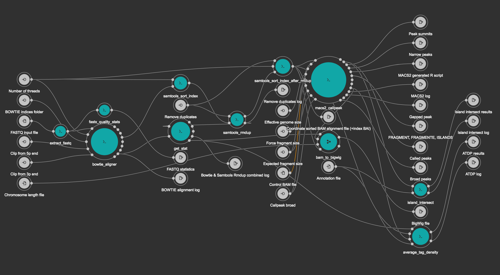

[](https://zenodo.org/badge/latestdoi/90777848)

# ChIP-Seq-SE CWL pipeline from BioWardrobe 

This workflow is a CWL version of a Python pipeline from BioWardrobe (Kartashov and Barski, 2015).
It starts by extracting input FASTQ file (if it was compressed). Next step runs
[BowTie](http://bowtie-bio.sourceforge.net/index.shtml) (Langmead et al., 2009) to perform alignment to a reference genome,
resulting in an unsorted SAM file. The SAM file is then sorted and indexed with [Samtools](http://samtools.sourceforge.net/)
(Li et al., 2009) to obtain a BAM file and a BAI index. Next [MACS2](http://liulab.dfci.harvard.edu/MACS/) (Zhang et al., 2008)
is used to call peaks and to estimate fragment size. In the last few steps, the coverage
by estimated fragments is calculated from the BAM file and is reported in bigWig format.
The pipeline also reports statistics, such as read quality, peak number and base frequency,
and other troubleshooting information using tools such as
[Fastx-toolkit](http://hannonlab.cshl.edu/fastx_toolkit/) and
[Bamtools](https://github.com/pezmaster31/bamtools).

This workflow [v0.0.2](https://github.com/Barski-lab/ga4gh_challenge/releases/tag/v0.0.2) was used for
[GA4GH-DREAM Workflow Execution Challenge](https://www.synapse.org/#!Synapse:syn8507133/wiki/415976).

## Requirements
1. Ubuntu 16.04.4 or macOS 10.13.5
2. Either of Python 2.7, 3.5, 3.6 or 3.7
3. docker (for Ubuntu read [here](https://docs.docker.com/install/linux/docker-ce/ubuntu/), for macOS read [here](https://docs.docker.com/docker-for-mac/install/))
4. pip ([link](https://pip.pypa.io/en/stable/installing/) to the latest stable pip)
5. cwltool (install from  [here](https://github.com/common-workflow-language/cwltool))


___
## To run the workflow

1. Download the latest workflow version
   ```
   $ git clone --recursive https://github.com/Barski-lab/ga4gh_challenge.git
   ```
   Use `--recursive` to fetch the [ga4gh_challenge_data](https://github.com/michael-kotliar/ga4gh_challenge_data) submodule (download time depends on your Internet connection speed)

2. Prepare input data
   ```
   $ cd ./ga4gh_challenge/data 
   $ ./prepare_inputs.sh
   ```
   The script will uncompress the input FASTQ file.

3. Run the workflow (tested with *cwltool==1.0.20181217162649*)
   ```
   $ mkdir ../outputs && cd ../outputs
   $ cwltool ../biowardrobe_chipseq_se.cwl ../biowardrobe_chipseq_se.yaml
   ```
   Results will be saved into the `outputs` directory
___

Pipeline's structural scheme generated by [Rabix Composer](http://rabix.io/).



